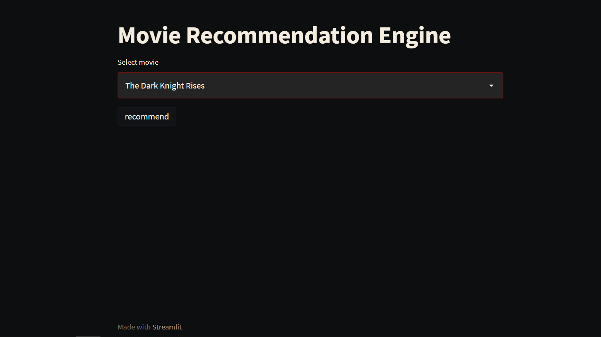
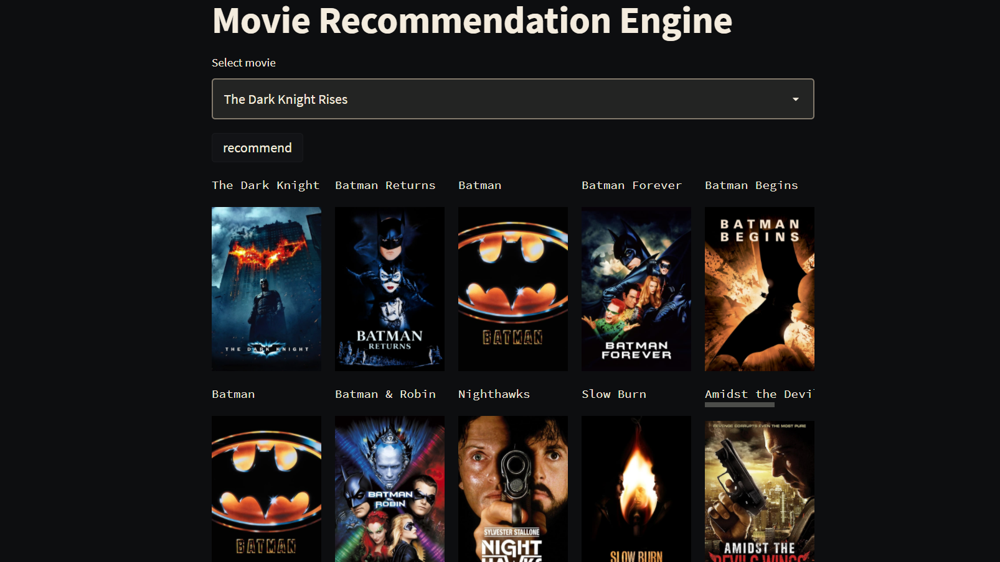

# Movie Recommendation System

In this project, i tried to make a content based movie recommendation System.

project link :- https://movierecommendation-ai.herokuapp.com/

## Overview

    
    
## Project Flow

## 1. Data Gathering 
Dataset for this project is gathered from kaggel (https://www.kaggle.com/tmdb/tmdb-movie-metadata)

## 2. Exploring and cleanning Dataset
In this various step are performed like, \
    - explore the datasets \
    - the unrelated feature are deleted. \
    - clean the choosen feature \
    - apply different transformations, to make data in right format \
    - create new feature 

## 3. Actually creating the system
So basically,I try to create some tags to each movie based on similarity they have, in mathematical terms those tags represents a vector.
so for recommendation we just need to know which vectors are closer to out choosen vector.
and that is determined by cosine distace.

## 4. Deply the system on web
after creating the system, deploy it on web with streamlit
